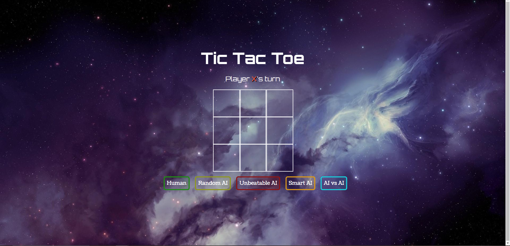
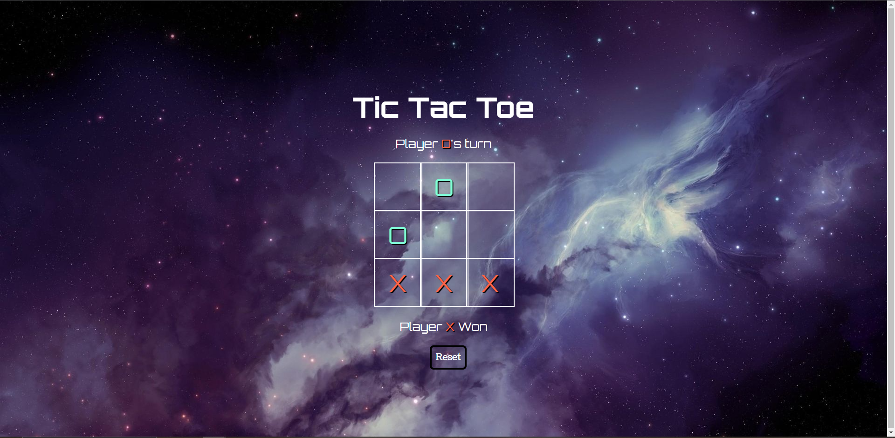

# Tic Tac Toe

## Description
The game is played on a grid that's 3 squares by 3 squares. You are X , your friend (or the computer in this case) is O . Players take 
turns putting their marks in empty squares. The first player to get 3 of her marks in a row (up, down, across, or diagonally) is the winner.

## Game modes
1. Human vs Human
2. Human vs RandomAI (computer places on random free spots)
3. Human vs SmartAI (computer will go for the win and prevent you for winning)
4. Human vs UnbeatableAI (try to beat this one - achived using the basic minmax algorithm)
5. RandomAI vs RandomAI (used to test functionality of random placement, but we kept it for fun - doesn't have time delay on placement)

## Tools and technologies learned
- recap of JS, HTML and CSS
- game logic
- work with matrices and algorithms

## Installation
Simply clone the repo in your PC and open the index.html file on a server.
Example: I prefer to use the Live-Server extension for VSCode to host the file on a local server.

## Visuals

### Menu Screen

### Gameplay

### Winning Screen
